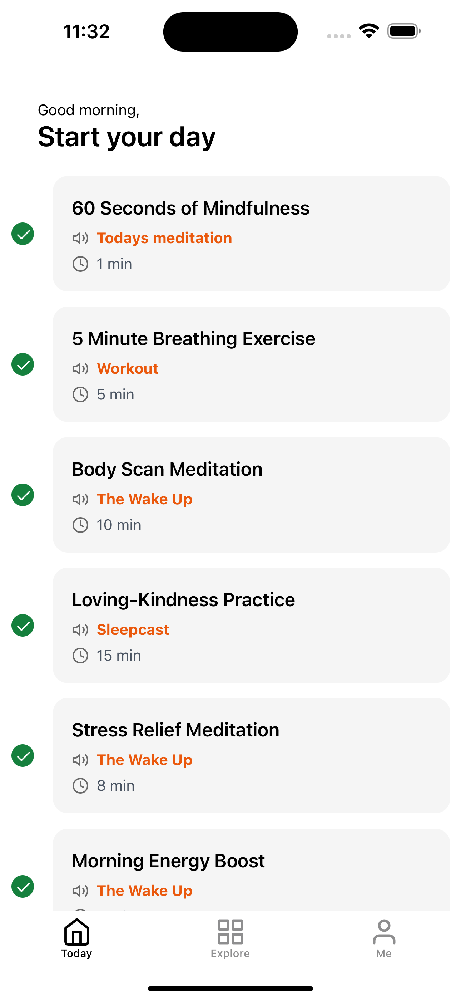
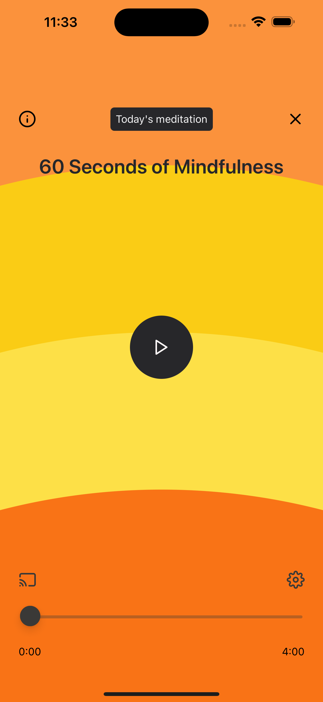

# A Lite Copy of the Headspace app 👋

This is a lightweight copy of the Headspace app. Playing around with the latest Expo SDK, navigation using `expo-router`, simple animations using `react-native-reanimated`, playing music using the new `expo-audio` api.




This is an [Expo](https://expo.dev) project created with [`create-expo-app`](https://www.npmjs.com/package/create-expo-app).

## Get started

1. Install dependencies

   ```bash
   npm install
   ```

2. Start the app

   ```bash
    npx expo start
   ```
